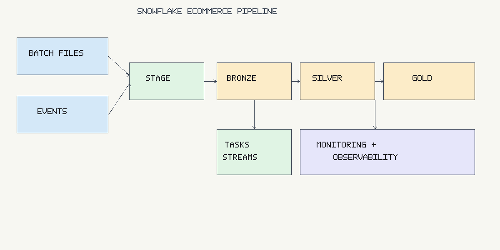

# Snowflake End-to-End Data Pipeline (E-commerce)

A **production-grade data engineering pipeline** built entirely on Snowflake, modeled after what a real data team would operate inside an enterprise e-commerce company. The pipeline ingests batch and event data, transforms it through a layered medallion architecture (bronze → silver → gold), enforces data governance, and exposes analytics-ready tables for BI, finance, product, and compliance teams.

This is not a toy project. It covers the problems that actually consume a data engineer's time: late-arriving data, PII governance, refund handling, revenue reconciliation, GDPR compliance, clickstream analysis, and operational alerting.

---

## Architecture



---

## Why This Pipeline Exists

In a real e-commerce organization, data engineering sits at the intersection of every team:

- **Finance** needs revenue numbers that tie out — gross vs net, with refunds accounted for.
- **Product/Marketing** needs sessionized clickstream data and conversion funnels.
- **Legal/Compliance** needs the ability to delete a customer's data and prove it happened.
- **Security** needs PII controls so analysts can query freely without seeing raw emails.
- **Operations** needs to know when the pipeline breaks before someone opens a dashboard and sees stale data.

This pipeline addresses all of these, using native Snowflake features — no external orchestrator, no Python glue, no third-party tools.

---

## What the Pipeline Does

### Data Sources

| Source | Format | Ingestion Pattern | Description |
|--------|--------|-------------------|-------------|
| Customers | CSV | Batch (hourly) | Customer master with region, PII fields |
| Products | CSV | Batch (hourly) | Product catalog with pricing |
| Orders | CSV | Batch (hourly) | Order header with line totals |
| Payments | CSV | Batch (hourly) | Payment transactions (can arrive late) |
| Returns | CSV | Batch (hourly) | Refund requests with reason codes |
| Clickstream Events | JSON | Near-real-time (5 min) | Page views, product views, add-to-cart, checkout, purchase |

All sources land in an internal Snowflake stage (`@ECOM_RAW_STAGE`) via `PUT` commands. In production, this would be replaced by an external stage pointing to S3/GCS/Azure Blob with Snowpipe for continuous ingestion.

### End-to-End Data Flow

```
CSV/JSON files
    │
    ▼
[ Internal Stage: @ECOM_RAW_STAGE ]
    │
    ▼  COPY INTO (SP_INGEST_BATCH / SP_INGEST_EVENTS)
    │
[ BRONZE: Raw tables with ingestion metadata ]
    │
    ▼  Streams capture CDC (inserts + updates)
    │
[ SILVER: Cleaned, deduplicated, typed tables ]
    │
    ▼  MERGE via SP_MERGE_SILVER
    │
[ GOLD: Dimensions, facts, aggregates, views ]
    │
    ├── DIM_CUSTOMER (SCD2, PII masked)
    ├── DIM_PRODUCT (Type 1)
    ├── FACT_ORDERS
    ├── FACT_PAYMENTS
    ├── FACT_RETURNS
    ├── FACT_EVENTS
    ├── FACT_SESSIONS (sessionized clickstream)
    ├── AGG_DAILY_SALES (gross / refunds / net revenue)
    ├── VW_REVENUE_RECONCILIATION
    ├── VW_CONVERSION_FUNNEL
    └── VW_SESSION_KPIS
```

---

## Layer-by-Layer Breakdown

### 1. Ingestion (`sql/ingestion/`)

**What it does:** Sets up the Snowflake environment and loads raw data.

| Script | Purpose |
|--------|---------|
| `00_setup.sql` | Creates roles (`DE_ADMIN_ROLE`, `DE_INGEST_ROLE`, `DE_TRANSFORM_ROLE`, `DE_ANALYTICS_ROLE`, `DE_ANALYST_ROLE`), warehouses (XSMALL for ingestion, SMALL for transforms/analytics), database, schemas (BRONZE/SILVER/GOLD/UTIL), and grants |
| `01_create_stages.sql` | Creates CSV and JSON file formats with error-tolerant settings (`ERROR_ON_COLUMN_COUNT_MISMATCH = FALSE`), internal stage |
| `02_copy_into_raw.sql` | Two stored procedures — `SP_INGEST_BATCH()` loads all CSV sources (customers, products, orders, payments, returns), `SP_INGEST_EVENTS()` loads JSON clickstream data. Both add `ingestion_ts`, `source_file`, and `load_id` metadata |

**Why it matters:**
- `ERROR_ON_COLUMN_COUNT_MISMATCH = FALSE` allows schema evolution without breaking ingestion.
- Metadata columns (`source_file`, `load_id`) give you full lineage — when something looks wrong downstream, you can trace it back to the exact file and row.
- Separate warehouses for ingestion vs transforms prevent resource contention and make cost attribution straightforward.
- `ON_ERROR = 'CONTINUE'` ensures one bad row doesn't block an entire batch.

### 2. Bronze Layer (`sql/bronze/`)

**What it does:** Stores raw data exactly as received, with CDC tracking.

| Script | Purpose |
|--------|---------|
| `10_raw_tables.sql` | Six raw tables: `CUSTOMERS_RAW`, `PRODUCTS_RAW`, `ORDERS_RAW`, `PAYMENTS_RAW`, `RETURNS_RAW`, `EVENTS_RAW` (VARIANT payload for semi-structured data) |
| `11_streams.sql` | One stream per table to capture incremental changes. Events stream is `APPEND_ONLY = TRUE` (immutable events); all others track inserts and updates |

**Why it matters:**
- Bronze is your safety net. If a transformation is wrong, you can always reprocess from raw.
- Streams are the incremental engine — they track what changed since the last consumption, so downstream merges only process new/changed rows instead of full-table scans.
- `APPEND_ONLY = TRUE` on events is intentional: clickstream events are immutable facts. Setting this gives better performance and simpler semantics.

### 3. Silver Layer (`sql/silver/`)

**What it does:** Cleans, deduplicates, and type-casts data for reliable downstream use.

| Script | Purpose |
|--------|---------|
| `20_clean_tables.sql` | Six clean tables with NOT NULL constraints, primary keys (NOT ENFORCED — Snowflake uses them for query optimization), and search optimization on events |
| `21_merge_clean.sql` | `SP_MERGE_SILVER()` — incremental MERGE from bronze streams into silver. Deduplicates by business key using `ROW_NUMBER()`, handles late-arriving data by comparing `updated_at` timestamps |

**Why it matters:**
- The `ROW_NUMBER() OVER (PARTITION BY business_key ORDER BY updated_at DESC, ingestion_ts DESC)` pattern ensures that if the same record arrives multiple times (common with file-based ingestion), only the latest version wins.
- The `WHEN MATCHED AND NVL(src.updated_at, src.load_ts) >= NVL(tgt.updated_at, tgt.load_ts)` guard prevents late-arriving older records from overwriting newer data — a real problem when payment files arrive days after the order.
- `SEARCH OPTIMIZATION ON EQUALITY(user_id, session_id)` on events gives point-lookup performance without maintaining explicit indexes.

### 4. Gold Layer (`sql/gold/`)

**What it does:** Builds the analytics-ready dimensional model, business aggregations, and cross-domain views.

| Script | Purpose |
|--------|---------|
| `30_dim_fact.sql` | Table DDL for all dimensions, facts, and aggregates |
| `31_build_gold.sql` | `SP_BUILD_GOLD()` — builds everything: SCD2 customer dimension, Type 1 product dimension, all fact tables, sessionization, and daily sales aggregation |
| `32_reconciliation.sql` | `VW_REVENUE_RECONCILIATION` — joins orders, payments, and returns to flag mismatches. `VW_RECON_SUMMARY` — dashboard-ready summary |
| `33_sessionization.sql` | `FACT_SESSIONS` DDL, `VW_CONVERSION_FUNNEL` — 5-step funnel with drop-off rates, `VW_SESSION_KPIS` — bounce rate, conversion rate, avg session duration |

#### Dimensional Model

**DIM_CUSTOMER (SCD Type 2)**
- Tracks historical changes via `valid_from`, `valid_to`, `is_current`, and `hash_diff`.
- When a customer changes their email or phone, the old record is closed (`is_current = FALSE`, `valid_to` set to change timestamp) and a new record is inserted.
- `hash_diff = MD5(first_name|last_name|email|phone|region)` — the pipeline detects changes by comparing hashes, not individual fields. This scales cleanly when you add new tracked columns.
- Includes `region` for row-level security filtering.

**Why SCD2 and not just overwrite?** Because when finance asks "what was the customer's email when they placed order #9001 last quarter?", you need the historical version, not today's value. Revenue attribution, retention cohorts, and compliance investigations all depend on point-in-time accuracy.

**DIM_PRODUCT (SCD Type 1)**
- Simple overwrite — product corrections replace the old value.
- Type 1 is correct here because product data changes are corrections (typo in name, price update), not meaningful history.

**FACT_ORDERS / FACT_PAYMENTS / FACT_RETURNS / FACT_EVENTS**
- All facts join to `DIM_CUSTOMER` via `customer_sk` (surrogate key), enabling consistent analysis even when customer attributes change.
- All fact tables are clustered by date for efficient partition pruning on time-range queries.

**FACT_SESSIONS (Sessionized Clickstream)**
- Aggregates raw events by `session_id` into one row per session.
- Computes: `session_duration_sec`, `page_views`, `product_views`, `add_to_carts`, `checkouts_started`, `purchases`, `is_bounce` (single-event sessions), `is_conversion` (session with a purchase).
- `products_viewed` is stored as an ARRAY for flexible downstream analysis.

**AGG_DAILY_SALES**
- Not just revenue — shows `gross_revenue`, `total_refunds` (from approved returns), and `net_revenue`.
- This is what finance actually looks at. A pipeline that only shows gross revenue is lying to the business.

#### Revenue Reconciliation

`VW_REVENUE_RECONCILIATION` classifies every order into one of:
| Status | Meaning |
|--------|---------|
| `FULLY_PAID` | Settled payments match order total, no returns |
| `PAID_WITH_RETURN` | Fully paid but has associated returns |
| `PARTIAL_PENDING` | Some payments still pending |
| `UNDERPAID` | Settled amount < order total |
| `OVERPAID` | Settled amount > order total |
| `NO_PAYMENT` | Order exists but no payment record found |

Also computes `days_outstanding` for orders not fully settled — useful for AR aging reports.

#### Conversion Funnel

`VW_CONVERSION_FUNNEL` shows step-by-step conversion:
```
page_view → product_view → add_to_cart → checkout_start → purchase
```
With drop-off percentages at each step, broken down by device type. This is the view that product managers and growth teams live in.

### 5. Security & Compliance (`sql/security/`)

| Script | Purpose |
|--------|---------|
| `50_data_masking.sql` | Dynamic data masking policies + row access policy + region tags |
| `51_gdpr_compliance.sql` | `SP_GDPR_DELETE()` procedure + `GDPR_AUDIT_LOG` table |

#### PII Masking (Dynamic Data Masking)

Three masking policies applied to `DIM_CUSTOMER`:

| Column | Engineer sees | Analyst sees |
|--------|--------------|--------------|
| `email` | `jane@example.com` | `j***@***.com` |
| `phone` | `555-0100` | `***-**00` |
| `first_name` | `Jane` | `J***` |
| `last_name` | `Doe` | `D***` |

The policies are role-aware: `DE_ADMIN_ROLE`, `DE_TRANSFORM_ROLE`, and `DE_INGEST_ROLE` see real values. Everyone else (including `DE_ANALYST_ROLE`) sees masked data. No code changes needed in downstream queries — masking is transparent.

#### Row-Level Security

A row access policy (`RAP_REGION_FILTER`) uses Snowflake object tags to restrict which regions a role can see:
```sql
-- Restrict analyst to US_WEST customers only
ALTER ROLE DE_ANALYST_ROLE SET TAG ECOMMERCE_DB.UTIL.TAG_REGION = 'US_WEST';
```
Admin and transform roles bypass the filter and see all regions.

#### GDPR Right-to-Delete

`SP_GDPR_DELETE('C001')` performs a coordinated deletion:

1. **Silver layer** — hard-deletes from `CUSTOMERS`, `ORDERS`, `PAYMENTS`, `RETURNS`, `EVENTS` (all records for that customer).
2. **Gold layer** — anonymizes `DIM_CUSTOMER` (replaces PII with `'REDACTED'`, preserves `customer_sk` so fact table joins and aggregates remain valid).
3. **Audit trail** — logs every action to `GDPR_AUDIT_LOG` with `request_id`, table name, rows affected, requesting user, and timestamp.

**Why anonymize gold instead of deleting?** Because `FACT_ORDERS` references `customer_sk`. Deleting the dimension row would break joins and corrupt aggregates. By setting PII to `'REDACTED'` and keeping the surrogate key, historical revenue numbers stay correct — you just can't identify the person.

### 6. Data Quality (`sql/monitoring/40_data_quality_checks.sql`)

`SP_RUN_DQ_CHECKS()` runs after every gold build and logs results to `UTIL.DQ_RESULTS`:

| Check | Type | What it catches |
|-------|------|-----------------|
| `orders_row_count` | Completeness | Empty orders table after ingestion |
| `orders_freshness_24h` | Freshness | Stale data — no orders in last 24 hours |
| `orders_customer_id_not_null` | Validity | Null foreign keys that would break joins |
| `orders_unique_order_id` | Uniqueness | Duplicate orders from double-loading |
| `orders_customer_fk` | Referential integrity | Orphaned orders (customer doesn't exist) |
| `payments_order_fk` | Referential integrity | Orphaned payments (order doesn't exist) |
| `returns_order_fk` | Referential integrity | Orphaned returns |
| `returns_refund_not_exceeding_order` | Business rule | Refund amount > order total (data error or fraud) |
| `orders_with_no_payment` | Business rule | Orders without any payment record (flags as WARN) |

All results are stored with timestamps so you can trend failure rates over time.

### 7. Alerting & Observability (`sql/monitoring/`)

| Script | Purpose |
|--------|---------|
| `40_data_quality_checks.sql` | DQ check procedure + results table |
| `41_task_history.sql` | Task execution history (last 7 days) |
| `42_query_history.sql` | Query performance and cost attribution |
| `43_cost_usage.sql` | Warehouse credit consumption by warehouse |
| `44_time_travel_clone.sql` | Time travel queries and zero-copy clone for dev/test |
| `45_dq_alerting.sql` | Snowflake ALERT on DQ failures + trend/status views |

#### DQ Alerting

A native Snowflake `ALERT` runs every 15 minutes. If any DQ check failed in the last 15 minutes, it sends an email via `SYSTEM$SEND_EMAIL`. No external cron jobs or Lambda functions needed.

Supporting views:
- `VW_DQ_FAILURE_TREND` — rolling 7-day failure rate per check (for dashboards).
- `VW_DQ_LATEST_STATUS` — latest pass/fail status per check (for a status page).

### 8. Orchestration (`orchestration/tasks.sql`)

```
TASK_INGEST_BATCH (hourly)  ──┐
                              ├──► TASK_MERGE_SILVER ──► TASK_BUILD_GOLD ──► TASK_DQ_CHECKS
TASK_INGEST_EVENTS (5 min) ───┘
```

- Tasks run with `SUSPEND_TASK_AFTER_NUM_FAILURES` to auto-pause after repeated failures (3 for most, 5 for events which are higher frequency).
- Silver merge waits for both ingestion tasks to complete (`AFTER TASK_INGEST_BATCH, TASK_INGEST_EVENTS`).
- Gold build includes sessionization and returns processing in a single procedure to minimize scheduling complexity.

### 9. Cost Controls

| Control | How |
|---------|-----|
| Right-sized warehouses | XSMALL for ingestion, SMALL for transforms |
| Auto-suspend | 60s for ETL warehouses, 300s for analytics |
| Incremental processing | Streams + MERGE — only new/changed rows |
| Rolling window aggregates | `AGG_DAILY_SALES` only processes last 30 days |
| Clustering | Fact tables clustered by date for partition pruning |
| Search optimization | Events table for `user_id`/`session_id` point lookups |
| 7-day time travel | Balances recovery vs storage cost |

---

## Repository Structure

```
snowflake-end-to-end-pipeline/
│
├── README.md
│
├── architecture/
│   └── pipeline_architecture.png
│
├── sql/
│   ├── ingestion/
│   │   ├── 00_setup.sql               # Roles, warehouses, database, schemas, grants
│   │   ├── 01_create_stages.sql        # File formats (CSV/JSON) and internal stage
│   │   └── 02_copy_into_raw.sql        # SP_INGEST_BATCH + SP_INGEST_EVENTS
│   │
│   ├── bronze/
│   │   ├── 10_raw_tables.sql           # 6 raw landing tables with metadata columns
│   │   └── 11_streams.sql              # CDC streams on all raw tables
│   │
│   ├── silver/
│   │   ├── 20_clean_tables.sql         # 6 clean tables with constraints + search optimization
│   │   └── 21_merge_clean.sql          # SP_MERGE_SILVER (incremental MERGE from streams)
│   │
│   ├── gold/
│   │   ├── 30_dim_fact.sql             # DDL: dimensions, facts, aggregates
│   │   ├── 31_build_gold.sql           # SP_BUILD_GOLD (SCD2, facts, sessions, daily agg)
│   │   ├── 32_reconciliation.sql       # VW_REVENUE_RECONCILIATION + VW_RECON_SUMMARY
│   │   └── 33_sessionization.sql       # FACT_SESSIONS DDL + funnel/KPI views
│   │
│   ├── security/
│   │   ├── 50_data_masking.sql         # Dynamic masking policies + row access policy
│   │   └── 51_gdpr_compliance.sql      # SP_GDPR_DELETE + GDPR_AUDIT_LOG
│   │
│   └── monitoring/
│       ├── 40_data_quality_checks.sql  # SP_RUN_DQ_CHECKS (9 checks) + DQ_RESULTS table
│       ├── 41_task_history.sql         # Task execution history query
│       ├── 42_query_history.sql        # Query performance + cost attribution
│       ├── 43_cost_usage.sql           # Warehouse credit consumption
│       ├── 44_time_travel_clone.sql    # Time travel + zero-copy clone examples
│       └── 45_dq_alerting.sql          # Snowflake ALERT + failure trend views
│
├── orchestration/
│   └── tasks.sql                       # Task DAG: ingest → silver → gold → DQ
│
├── data/
│   └── sample_files/
│       ├── customers.csv               # 4 customers with region
│       ├── products.csv                # Product catalog
│       ├── orders.csv                  # 4 orders
│       ├── payments.csv                # Payment transactions
│       ├── returns.csv                 # 3 return/refund requests
│       ├── events.json                 # 5 clickstream events (page_view → purchase)
│       ├── customers_v2.csv            # Schema evolution demo (added region column)
│       └── late_arriving_payments.csv  # Late-arriving payment updates
│
└── docs/
    ├── design_decisions.md             # Why each architectural choice was made
    ├── data_model.md                   # Table-level documentation with grain and keys
    └── cost_optimization.md            # Warehouse sizing, clustering, and trade-offs
```

---

## Setup Instructions

Run in order via Snowsight or SnowSQL. Each script is self-contained with the correct role/warehouse context.

| Step | Script | What it creates |
|------|--------|-----------------|
| 1 | `sql/ingestion/00_setup.sql` | 5 roles, 3 warehouses, 1 database, 4 schemas, all grants |
| 2 | `sql/ingestion/01_create_stages.sql` | CSV/JSON file formats, internal stage |
| 3 | `sql/bronze/10_raw_tables.sql` | 6 raw landing tables |
| 4 | `sql/bronze/11_streams.sql` | 6 CDC streams |
| 5 | `sql/ingestion/02_copy_into_raw.sql` | 2 ingestion stored procedures |
| 6 | `sql/silver/20_clean_tables.sql` | 6 clean tables with search optimization |
| 7 | `sql/silver/21_merge_clean.sql` | SP_MERGE_SILVER |
| 8 | `sql/gold/30_dim_fact.sql` | 2 dimensions, 5 fact tables, 1 aggregate table |
| 9 | `sql/gold/31_build_gold.sql` | SP_BUILD_GOLD |
| 10 | `sql/gold/32_reconciliation.sql` | 2 reconciliation views |
| 11 | `sql/gold/33_sessionization.sql` | FACT_SESSIONS + 2 analytics views |
| 12 | `sql/monitoring/40_data_quality_checks.sql` | SP_RUN_DQ_CHECKS + DQ_RESULTS table |
| 13 | `sql/security/50_data_masking.sql` | 3 masking policies + 1 row access policy + region tag |
| 14 | `sql/security/51_gdpr_compliance.sql` | SP_GDPR_DELETE + GDPR_AUDIT_LOG |
| 15 | `sql/monitoring/45_dq_alerting.sql` | Snowflake ALERT + 2 trend views |
| 16 | `orchestration/tasks.sql` | 5-task DAG with retry/suspend behavior |

---

## Load Sample Data

```sql
PUT file://path/to/data/sample_files/customers.csv @ECOM_RAW_STAGE/batch/ AUTO_COMPRESS=TRUE;
PUT file://path/to/data/sample_files/products.csv  @ECOM_RAW_STAGE/batch/ AUTO_COMPRESS=TRUE;
PUT file://path/to/data/sample_files/orders.csv    @ECOM_RAW_STAGE/batch/ AUTO_COMPRESS=TRUE;
PUT file://path/to/data/sample_files/payments.csv  @ECOM_RAW_STAGE/batch/ AUTO_COMPRESS=TRUE;
PUT file://path/to/data/sample_files/returns.csv   @ECOM_RAW_STAGE/batch/ AUTO_COMPRESS=TRUE;
PUT file://path/to/data/sample_files/events.json   @ECOM_RAW_STAGE/events/ AUTO_COMPRESS=TRUE;
```

Then run manually or let tasks handle it:
```sql
CALL UTIL.SP_INGEST_BATCH();
CALL UTIL.SP_INGEST_EVENTS();
CALL UTIL.SP_MERGE_SILVER();
CALL UTIL.SP_BUILD_GOLD();
CALL UTIL.SP_RUN_DQ_CHECKS();
```

### Test Late-Arriving Data

Load the late-arriving payments file to see how the pipeline handles out-of-order data:
```sql
PUT file://path/to/data/sample_files/late_arriving_payments.csv @ECOM_RAW_STAGE/batch/ AUTO_COMPRESS=TRUE;
CALL UTIL.SP_INGEST_BATCH();
CALL UTIL.SP_MERGE_SILVER();
-- Silver merge updates PMT3 status from PENDING to SETTLED (newer updated_at wins)
```

---

## Verify the Pipeline

### Core Analytics
```sql
SELECT * FROM GOLD.FACT_ORDERS;
SELECT * FROM GOLD.FACT_RETURNS;
SELECT * FROM GOLD.FACT_SESSIONS;
SELECT * FROM GOLD.AGG_DAILY_SALES;  -- gross_revenue, total_refunds, net_revenue
```

### Revenue Reconciliation
```sql
SELECT * FROM GOLD.VW_REVENUE_RECONCILIATION;
-- Shows: FULLY_PAID, UNDERPAID, OVERPAID, PARTIAL_PENDING, NO_PAYMENT, PAID_WITH_RETURN

SELECT * FROM GOLD.VW_RECON_SUMMARY;
-- Aggregated by recon_status with total_outstanding
```

### Conversion Funnel
```sql
SELECT * FROM GOLD.VW_CONVERSION_FUNNEL;
-- page_view → product_view → add_to_cart → checkout → purchase with drop-off %

SELECT * FROM GOLD.VW_SESSION_KPIS;
-- bounce_rate_pct, conversion_rate_pct, avg_session_duration_sec by device
```

### PII Masking
```sql
USE ROLE DE_ANALYST_ROLE;
SELECT customer_id, first_name, last_name, email, phone FROM GOLD.DIM_CUSTOMER;
-- Output: C001, J***, D***, j***@***.com, ***-**00

USE ROLE DE_TRANSFORM_ROLE;
SELECT customer_id, first_name, last_name, email, phone FROM GOLD.DIM_CUSTOMER;
-- Output: C001, Jane, Doe, jane@example.com, 555-0100
```

### GDPR Deletion
```sql
CALL UTIL.SP_GDPR_DELETE('C001');
-- Deletes from silver, anonymizes in gold, logs to audit

SELECT * FROM UTIL.GDPR_AUDIT_LOG;
-- Shows every table affected, row counts, requesting user, timestamps

SELECT * FROM GOLD.DIM_CUSTOMER WHERE customer_id = 'C001';
-- first_name = 'REDACTED', email = 'REDACTED', customer_sk still intact
```

### Data Quality
```sql
SELECT * FROM UTIL.DQ_FAILURES;                 -- Current failures
SELECT * FROM UTIL.VW_DQ_LATEST_STATUS;          -- Latest status per check
SELECT * FROM UTIL.VW_DQ_FAILURE_TREND;           -- 7-day failure rate trend
```

---

## Snowflake Features Used

| Feature | Where | Why |
|---------|-------|-----|
| Streams | Bronze → Silver | Incremental CDC without external tools |
| Tasks | Orchestration | Native DAG with dependency chains and retry |
| MERGE | Silver + Gold | Idempotent upserts for exactly-once semantics |
| SCD Type 2 | DIM_CUSTOMER | Historical accuracy for revenue attribution |
| Dynamic Data Masking | DIM_CUSTOMER | Role-based PII protection without code changes |
| Row Access Policy | DIM_CUSTOMER | Regional data filtering via tags |
| ALERT | DQ Monitoring | Automated failure notification (email) |
| Search Optimization | EVENTS | Fast point lookups on user_id/session_id |
| Clustering | All fact tables | Partition pruning on date columns |
| VARIANT | Events | Semi-structured payload for schema flexibility |
| Time Travel | Recovery | Point-in-time queries and accidental delete recovery |
| Zero-Copy Clone | Dev/Test | Full database clone without storage duplication |
| Sequences | Surrogate keys | Auto-incrementing customer_sk, product_sk |
| Stored Procedures | All layers | Encapsulated, rerunnable transformation logic |

---

## RBAC Model

```
SYSADMIN
  └── DE_ADMIN_ROLE
        ├── DE_INGEST_ROLE      (INGEST_WH — bronze read/write, stages)
        ├── DE_TRANSFORM_ROLE   (TRANSFORM_WH — silver/gold read/write, full PII)
        ├── DE_ANALYTICS_ROLE   (ANALYTICS_WH — gold read-only, full PII)
        └── DE_ANALYST_ROLE     (ANALYTICS_WH — gold read-only, PII masked, region filtered)
```

---

## Design Decisions

See [docs/design_decisions.md](docs/design_decisions.md) for the full rationale. Key highlights:

- **Streams + Tasks over Dynamic Tables** — more control, better auditability, explicit dependency management.
- **SCD2 over simple overwrites** — historical accuracy matters for finance and retention analysis.
- **Net revenue over gross-only** — gross revenue without refunds is a lie. Finance needs both.
- **Masking over separate views** — dynamic masking is transparent to consumers. No need to maintain separate "safe" views.
- **Anonymize over delete in gold** — preserves aggregate integrity while satisfying GDPR requirements.
- **Hash-based change detection** — `MD5(CONCAT_WS(...))` scales better than comparing N individual columns.

---

## Further Reading

- [Data Model](docs/data_model.md) — table-level documentation with grain, keys, and metrics
- [Design Decisions](docs/design_decisions.md) — why each architectural choice was made
- [Cost Optimization](docs/cost_optimization.md) — warehouse sizing, clustering, and trade-offs
